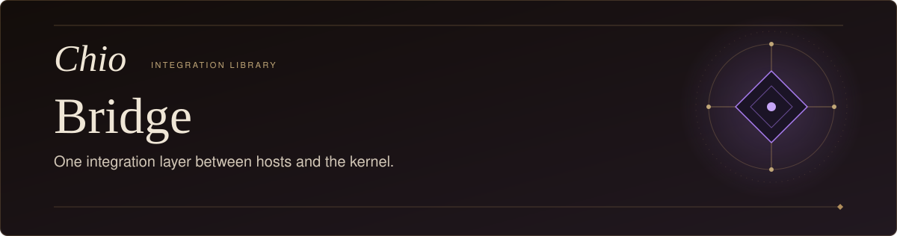
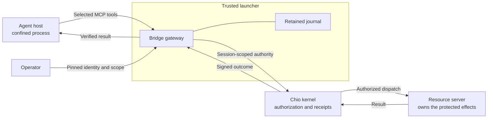

<p align="center">
  <picture>
    <source media="(max-width: 600px)" srcset="docs/assets/readme-hero-mobile.svg" />
    
  </picture>
</p>

<p align="center">
  <a href="LICENSE"></a>
  
  
</p>

<p align="center"><strong>Give your agent integration a kernel-owned execution path and a verifiable result.</strong></p>

<p align="center">
  <a href="#what-the-bridge-does">Purpose</a>&nbsp;&nbsp;&middot;&nbsp;&nbsp;
  <a href="#install">Install</a>&nbsp;&nbsp;&middot;&nbsp;&nbsp;
  <a href="#connect-a-host">Connect a host</a>&nbsp;&nbsp;&middot;&nbsp;&nbsp;
  <a href="#verify-a-result">Verify a result</a>&nbsp;&nbsp;&middot;&nbsp;&nbsp;
  <a href="#api-guide">API</a>&nbsp;&nbsp;&middot;&nbsp;&nbsp;
  <a href="#development">Development</a>
</p>

## What the bridge does

`@chio/bridge` is the TypeScript integration library for plugin and launcher authors building on the [Chio kernel](https://github.com/backbay-labs/chio). It connects an agent host to selected kernel tools, retains operation identity across failures, and verifies the signed result against the intended caller and request. It also provides policy, passport, capability, and receipt APIs over the Chio SDK and local CLI.

**Current delivery:** version `0.3.0` is a source-build qualification candidate, not a published npm release. Protected execution requires a matching kernel candidate and a confined host launcher. Installing the bridge does not establish host acceptance. See the [execution contract and limits](ACCEPTANCE.md) and [release qualification](docs/RELEASE-QUALIFICATION.md).

The bridge gives an integration three reusable pieces:

- **A bounded tool route.** A gateway in the trusted launcher exposes the operator-selected tools using a retained, session-scoped kernel credential.
- **A durable record of each attempt.** The gateway records a request before dispatch and retains the outcome. An uncertain effect cannot silently become a fresh attempt.
- **Result verification.** Verification binds the receipt to a trusted signer, caller, capability, resource server, tool, arguments, request ID, and returned bytes.



The launcher must enforce this boundary: the host cannot read operator credentials or modify the gateway journal, reach the kernel directly, or access the protected resource through another tool. Native shell, file, network, delegation, and discovered extension paths need prevention or must be disabled in the supported host mode. The bridge supplies the transport and verification; the host integration supplies that confinement.

## Install

Requires **Node.js 22 or later**, npm, and an ESM consumer. Build the candidate from the public repository:

```sh
git clone https://github.com/backbay-labs/chio-bridge.git
cd chio-bridge
npm ci --ignore-scripts --no-audit --no-fund
npm run typecheck
npm run pack:release -- ./artifacts
```

The packaging command builds the library and emits `artifacts/chio-bridge-0.3.0.tgz` plus its SHA-256 sidecar. It bundles the checked-in SDK candidate and production dependencies. No private sibling checkout is needed. Retain the source commit and emitted checksum with your integration configuration.

From your consuming project, install that archive using its actual absolute path:

```sh
npm install --offline --ignore-scripts --no-audit --no-fund \
  /absolute/path/to/chio-bridge/artifacts/chio-bridge-0.3.0.tgz
```

This installs the library and the `chio-prepare-gateway`, `chio-mcp-gateway`, `chio-gateway-operator`, and `chio-doctor` binaries. The kernel is a separate dependency: use the compatible candidate recorded for your integration. The original public CLI `0.1.0` does not establish compatibility with these execution surfaces.

## Connect a host

1. **Prepare authority outside the host.** Follow the [operator procedure](ACCEPTANCE.md#operator-procedure) to configure the durable kernel, constrained resource server, private operator request, and explicit tool scope. The request pins the kernel's trusted signer keys. Kernel client endpoints use an origin such as `http://127.0.0.1:8931`, without `/mcp`.
2. **Create one retained gateway configuration.** From the consuming project, run the installed binary below. Preparation validates the kernel context and obtains a session-only credential; it executes no tool.

   ```sh
   ./node_modules/.bin/chio-prepare-gateway \
     /absolute/private/operator-request.json \
     /absolute/private/gateway-config.json
   ```

3. **Start the transport in your trusted launcher.** Import `startGatewayHttp` from `@chio/bridge` and call it with that configuration. Configure the host's sole MCP server with the returned `url` and `Authorization: Bearer <token>` header. Keep the configuration and journal outside the guest process boundary, and call the transport's `close()` when the host exits. Its token authorizes only this local transport; it is not the kernel credential.
4. **Observe delivery before acknowledging it.** Connect the launcher's native host-history observer to `acknowledgeReceivedOutcome()` only after it observes the actual completed tool result, before the next model turn. A gateway response alone does not prove the host received it. See [delivery acknowledgement](ACCEPTANCE.md#gateway-to-host-delivery-loss).

`chio-mcp-gateway /absolute/private/gateway-config.json` also exposes a stdio transport, for integrations with a separately qualified process boundary. A host-owned stdio child is not automatically isolated from its parent.

The [HTTP transport API](src/gateway-http.ts) and [gateway configuration](src/gateway.ts) define the launcher contract. Protected execution currently supports value-returning MCP tools; streaming tool results need separate support and qualification.

## Verify a result

Use `verifyCompletedOutcome` when consuming a retained completion. This small helper accepts the original authority and request, and returns the result only when the full binding verifies:

```ts
import {
  verifyCompletedOutcome,
  type ExecutionOutcome,
  type ExecutionRequest,
  type McpExecutionOptions,
} from "@chio/bridge";

export function requireCompletedResult(
  outcome: ExecutionOutcome,
  authority: McpExecutionOptions,
  originalRequest: ExecutionRequest,
): unknown {
  if (!verifyCompletedOutcome(outcome, authority, originalRequest)) {
    throw new Error("Completion does not match the retained authority and request");
  }
  return outcome.result;
}
```

Supply `authority` from the protected gateway configuration's `execution` field: it contains the operator-pinned `trustedSigners`, intended `subjectKey`, `capabilityId`, and `serverId`. Supply `originalRequest` from the durable request record, including its original `requestId`, tool, arguments, and any approval metadata. Do not derive either expectation from the receipt being verified.

This checks the signed decision, terminal completion metadata, result hash, and exact request hash. It does not acknowledge delivery or execute anything. A completed invocation can still contain an MCP tool error (`isError: true`); handle that result truthfully. The simpler `verifyReceipt()` signature check does not establish the intended signer, caller, request, or claimed result on its own.

## Failure and recovery

**A lost response is an unknown outcome, not permission to retry.** The gateway records pending work before contacting the kernel. It persists and verifies a completed result before acknowledging it to the owner. The parent HTTP transport additionally requires proof that the host received the result. Missing evidence leaves further dispatch blocked, including after restart.

Retain the original request ID, session, configuration, and journal. Reconcile the independently owned resource and kernel record before recovery. Do not delete the journal, create another session, or manufacture an acknowledgement to clear a block. The operator tools can inspect state, recover a dead process lock, and import a verified owner result without redispatching it.

- [Recovery, upgrade, and removal](ACCEPTANCE.md#recovery-upgrade-and-removal)
- [Owner-result recovery qualification](acceptance/2026-09-09/owner-recovery/README.md)
- [Explicit approval proposals and resumption](ACCEPTANCE.md#explicit-approval-proposals)

<details>
<summary>Recover a completed owner result missing from the bridge cache</summary>

Stop the host first. If a dead gateway left a lock, follow `recover-lock` in the operator procedure. For the qualified local owner, the separately shipped `export-owner-outcome.py` reads the exact session/request row from its SQLite database in read-only mode. Keep the exported file private; exporting alone does not establish trust.

```sh
chio-gateway-operator owner-result-import /absolute/original/gateway.json /absolute/private/owner-result.json
chio-gateway-operator delivery-export /absolute/original/gateway.json ORIGINAL_REQUEST_ID /absolute/private/received-result.json
```

Import verifies the owner's signature, caller, capability, resource, complete request, result, and acknowledgement proof. It preserves the uncertain record and leaves the recovered completion unacknowledged. It neither dispatches nor releases the block. Read and verify the exported result and independent resource observation before explicitly acknowledging:

```sh
chio-gateway-operator delivery-acknowledge /absolute/original/gateway.json /absolute/private/received-result.json
```

Missing, pending, unsigned, mismatched, or ambiguous owner results remain unresolved. Import cannot extend revoked or expired authority. A failed acknowledgement leaves dispatch blocked. These operator commands are separate from the host's delivery observer.

</details>

## API guide

| API | Use |
| --- | --- |
| [`startGatewayHttp()`](src/gateway-http.ts) | Host transport. The trusted parent owns configuration, journal, lifecycle, and delivery observation. |
| [`createMcpExecutionClient()`](src/execution.ts) | Lower-level execution using an existing scoped session. Its caller supplies durable request/outcome handling. |
| [`verifyCompletedOutcome()`](src/execution.ts) | Verify the complete result. `verifyBoundReceipt()` checks a decision; `verifyReceivedOutcome()` checks the host's received bytes. |
| [`ChioBridge`](src/index.ts) | `fromCli()` and `fromDaemon()` expose policy, explicit-subject passport, capability, and lifecycle APIs. |
| [Receipt access](src/receipts.ts) | `receipts()`, `receiptStream()`, and `exportEvidence()`. Export requires an explicit authorized read boundary; raw exports are not verified proofs. |

`check()` evaluates a local CLI policy. It never executes a tool, and daemon-only use fails closed. An allow result cannot establish prevention when followed by unrestricted host execution. Passport creation requires the intended subject public key. Capability attenuation is disabled until a parent-bound authority endpoint is qualified; there is no reissuance fallback.

The bridge also re-exports `ChioClient`, `ChioSession`, and `ReceiptQueryClient` from the SDK. See the [package exports](package.json) and [public types](src/types.ts) for the complete import surface.

## Development

After installing source dependencies:

```sh
npm run typecheck
npm run build
npm test
```

`npm run test:live` additionally needs the isolated kernel and harness setup described in [live API qualification](docs/RELEASE-QUALIFICATION.md#live-api-compatibility-qualification). It is separate from each real host's acceptance tests.

Use [release qualification](docs/RELEASE-QUALIFICATION.md) for clean consumer installation, artifact identity, CI, and promotion requirements. Keep the matching bridge, SDK, kernel, host, and configuration identities together when upgrading an integration.

[Apache-2.0](LICENSE) · [Chio](https://github.com/backbay-labs/chio) · [Execution contract](ACCEPTANCE.md) · [Source CI](.github/workflows/ci.yml)
